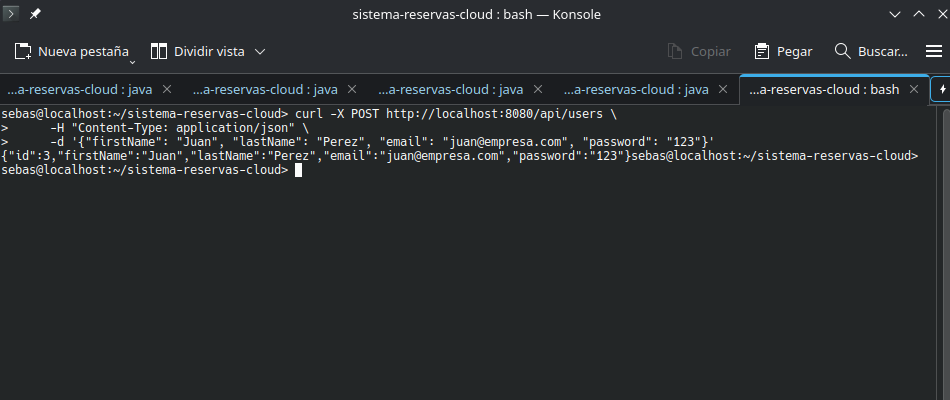
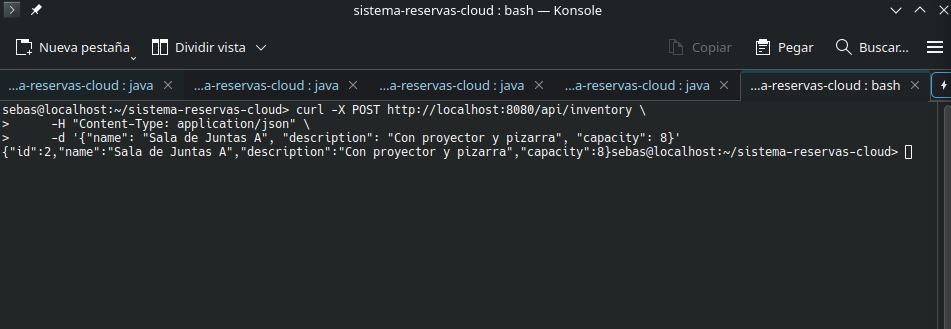
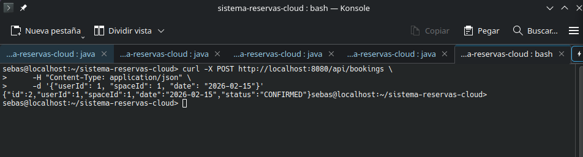
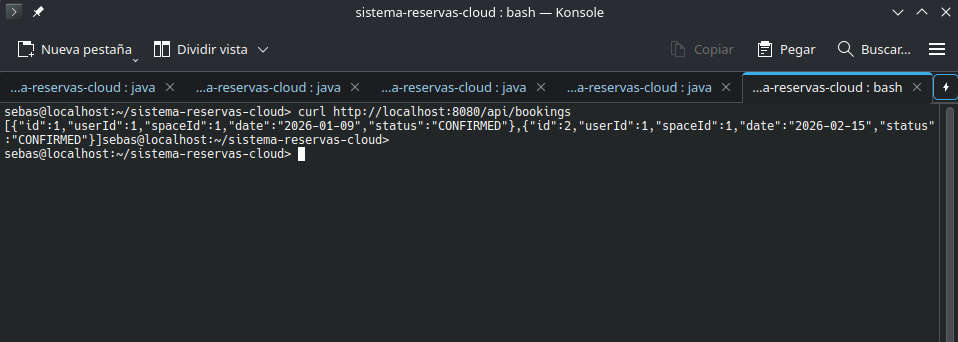

# 🧪 Informe de Pruebas del Sistema

## 1. Introducción
El objetivo de este documento es validar los flujos principales de negocio del Sistema de Reservas, asegurando la correcta integración entre los microservicios, el API Gateway y las bases de datos.

**Herramientas utilizadas:**
* Terminal Linux (Konsole, OpenSUSE)
* cURL (Simulación de Cliente)
* Logs de Spring Boot

---

## 2. Casos de Prueba Ejecutados

### Caso 1: Registro de Usuario
**Objetivo:** Verificar que el `User Service` recibe la petición a través del Gateway y persiste el usuario.
* **Endpoint:** `POST /api/users`
* **Resultado Esperado:** JSON con ID de usuario y status 200 OK.

**Evidencia:**

---

### Caso 2: Registro de Espacio (Inventario)
**Objetivo:** Verificar que el `Inventory Service` permite crear recursos reservables.
* **Endpoint:** `POST /api/inventory`
* **Resultado Esperado:** JSON con ID de espacio y status 200 OK.

**Evidencia:**

---

### Caso 3: Creación de Reserva (Flujo Crítico)
**Objetivo:** Verificar la integración completa. El `Booking Service` debe validar la solicitud.
* **Endpoint:** `POST /api/bookings`
* **Datos:** `UserId: 1`, `SpaceId: 1`
* **Resultado Esperado:** Reserva creada con estado **CONFIRMED**.

**Evidencia:**

---

### Caso 4: Persistencia de Datos
**Objetivo:** Consultar el listado para asegurar que los datos no se perdieron.
* **Endpoint:** `GET /api/bookings`

**Evidencia:**

---

## 3. Conclusión
El sistema ha superado exitosamente las pruebas funcionales de "Happy Path". La arquitectura de microservicios responde correctamente a través del Gateway único (Puerto 8080), demostrando la comunicación efectiva entre los componentes distribuidos.
