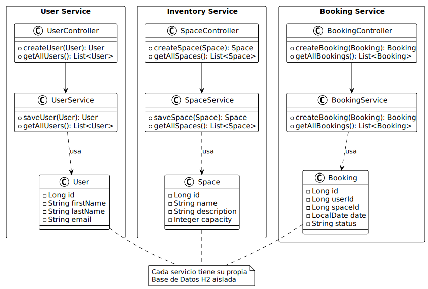

# Sistema de Reservas en la Nube (Microservicios)

Este proyecto implementa una arquitectura de microservicios para la gestión de reservas de espacios (oficinas, salas), cumpliendo con los requisitos del Módulo 2 de Arquitectura Cloud.

##  Arquitectura

El sistema consta de los siguientes componentes distribuidos:

1.  **Eureka Server (Puerto 8761):** Servidor de descubrimiento de servicios.
2.  **API Gateway (Puerto 8080):** Punto de entrada único que redirige el tráfico.
3.  **User Service (Puerto 8081):** Gestión de usuarios y autenticación.
4.  **Inventory Service (Puerto 8082):** Gestión de espacios disponibles.
5.  **Booking Service (Puerto 8083):** Gestión de las reservas (conecta usuarios con espacios).

### 🛠 Tecnologías Utilizadas
* **Lenguaje:** Java 17 / 21
* **Framework:** Spring Boot 3.2.1
* **Ecosistema Cloud:** Spring Cloud Netflix (Eureka), Spring Cloud Gateway.
* **Base de Datos:** H2 Database (En memoria, una por servicio).
* **Herramientas:** Maven, Git.

## 🚀 Instrucciones de Ejecución

### Prerrequisitos
* Java JDK 17 o superior.
* Maven instalado.

### Pasos para iniciar
El orden de inicio es estricto para evitar fallos de conexión:

1.  **Clonar el repositorio:**
    ```bash
    git clone https://github.com/Xagreth/sistema-reservas-cloud.git
    cd sistema-reservas-cloud
    ```

2.  **Compilar todo el proyecto:**
    ```bash
    mvn clean package -DskipTests
    ```

3.  **Iniciar Servicios (en terminales separadas):**
    * Terminal 1: `java -jar eureka-server/target/eureka-server-1.0.0-SNAPSHOT.jar`
    * Terminal 2: `java -jar api-gateway/target/api-gateway-1.0.0-SNAPSHOT.jar`
    * Terminal 3: `java -jar user-service/target/user-service-1.0.0-SNAPSHOT.jar`
    * Terminal 4: `java -jar inventory-service/target/inventory-service-1.0.0-SNAPSHOT.jar`
    * Terminal 5: `java -jar booking-service/target/booking-service-1.0.0-SNAPSHOT.jar`


**1. Crear Usuario:**
```bash
curl -X POST http://localhost:8080/api/users \
     -H "Content-Type: application/json" \
     -d '{"firstName": "Sebas", "lastName": "Dev", "email": "sebas@test.com", "password": "123"}'
```

**2. Crear Espacio (Sala):**
```bash
curl -X POST http://localhost:8080/api/inventory \
     -H "Content-Type: application/json" \
     -d '{"name": "Sala A", "description": "Proyector 4K", "capacity": 10}'
```

**3. Crear Reserva:**
```bash
curl -X POST http://localhost:8080/api/bookings \
     -H "Content-Type: application/json" \
     -d '{"userId": 1, "spaceId": 1, "date": "2026-01-20"}'
```

##  Diagrama de Clases


Proyecto realizado por Sebastián Carra Paredes para el examen del Módulo 2 de Arquitectura Cloud.

## Diagrama de Arquitectura

